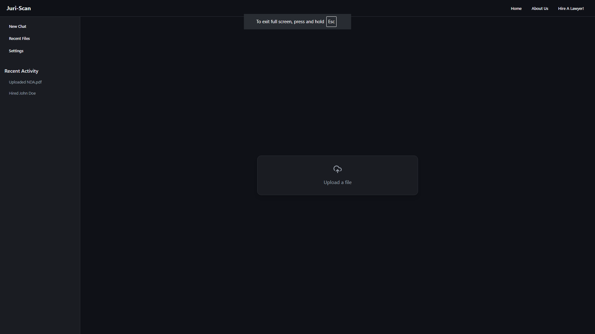
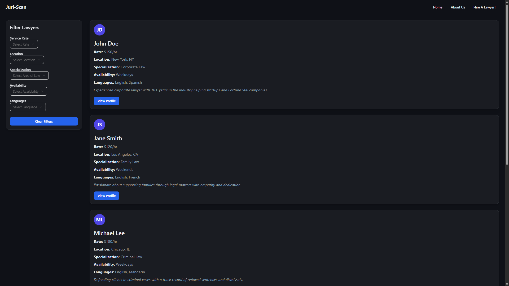
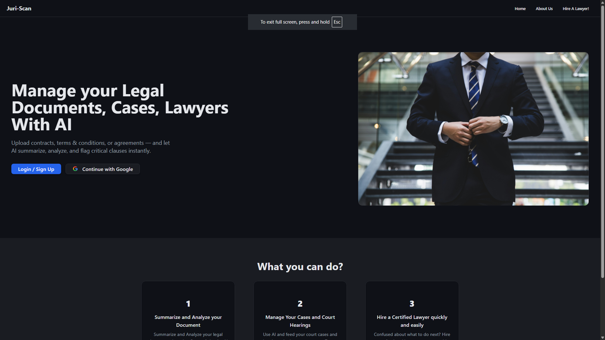

# 📄 JuriScan – AI-Powered Legal Document Analyzer
---

  
  


## 🚀 Overview

**JuriScan** is an AI-enhanced web application designed to simplify the legal review process. Upload legal documents such as contracts or agreements and instantly receive:

- ✅ Document summaries  
- 🚩 Detection of red flags or vague clauses  
- 💬 Interactive chat-based clarification with context-aware responses

---

## ✨ Key Features

- **🗂️ PDF Upload** – Securely upload legal documents (.pdf) for analysis  
- **📄 AI Summaries** – Concise section-based summaries via an LLM  
- **⚠️ Red Flag Analyzer** – Highlight risky terms like auto-renewal, termination clauses, etc.  
- **💬 Interactive Chat** – Ask follow-up questions in-app for deeper insights  
- **📚 Session History** – Keep track of document summaries and chat logs  
- **🔍 Lawyer Listings Module** – Browse lawyers by specialization, rate, availability  
- **🔒 Secure Authentication** – JWT-based login with protected routes

---

## 🧩 Tech Stack

| Component     | Technology                        |
|---------------|-----------------------------------|
| Frontend      | React (Vite), Tailwind CSS, shadcn UI |
| Data Viz      | Recharts                          |
| Backend       | Python Flask, REST API            |
| Database      | PostgreSQL                        |
| File Storage  | Local filesystem (`uploads/`)     |
| AI Model      | Local LLaMA-based LLM for document parsing |

---

## 📁 Project Structure

JuriScan/
├── JuriScan/ # React frontend code
│ ├── public/ # public assets & images
│ └── src/ # components, chat UI, hooks, styles
├── server/ # Flask backend
│ ├── app/__init__.py
│ ├── app/routes/ # API endpoints
│ ├── models/ # database ORM models
│ └── utils/ # LLM parsing, PDF extraction
├── uploads/ # secure storage for uploaded PDFs
└── README.md


---

## 🛠️ Installation & Setup

### 🔧 Prerequisites
Make sure you have:
- Node.js & npm
- Python 3.10+
- PostgreSQL up and running
- Virtual environment (`pipenv` or `venv`)

### 📦 Setup Instructions

1. **Clone** the repo:

    ```bash
    git clone https://github.com/RohanG610/JuriScan.git
    cd JuriScan
    ```

2. **Frontend**:

    ```bash
    cd JuriScan
    npm install
    npm run dev
    ```

3. **Backend**:

    ```bash
    cd server
    pip install -r requirements.txt
    python app.py
    ```

4. **Environment Variables**: Create a `.env` pointing to:
   - PostgreSQL DB URI
   - Flask `SECRET_KEY`
   - OPENAI_API_KEY
   - Google OAuth Information

---

## 🎯 How to Use 📋

1. Go to `http://localhost:5173` in your browser.
2. Log in or register to access the document upload page.
3. Upload a PDF and get:
   - ✅ Summary of key sections
   - ⚠️ Visual red flag highlights
4. Use the chat interface to ask follow-up questions like:
   - “Explain clause 5.2”
   - “Any outstanding liabilities?”
   - “Define ‘indemnification’ in this context”
5. Preview related lawyer profiles under the **Legal Counsel** tab

---

## 🤝 Contributing

Your help is welcome! Here's how to get started:

1. Fork the repo  
2. Create a feature branch:
    ```bash
    git checkout -b feature-new-flag
    ```
3. Commit and push your changes
4. Open a Pull Request with a description of your changes

---

## 📄 License

Distributed under the **MIT License**. See [LICENSE](LICENSE) for details.

---

## ⚠️ Disclaimer

**JuriScan is an educational and productivity tool — not a substitute for legal advice.** Always have a qualified attorney review critical documents before making decisions.

---

## 🙌 Acknowledgements

Built with ❤️ by [Rohan](https://github.com/RohanG610)  
Inspired by legaltech innovation and the need to democratize legal understanding.

---
